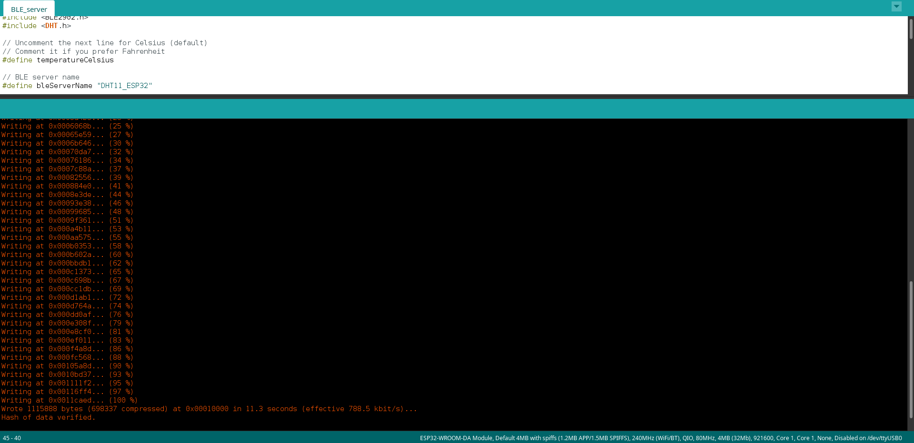
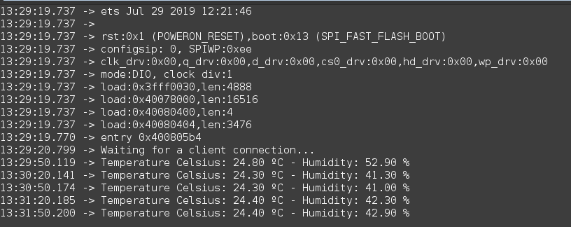
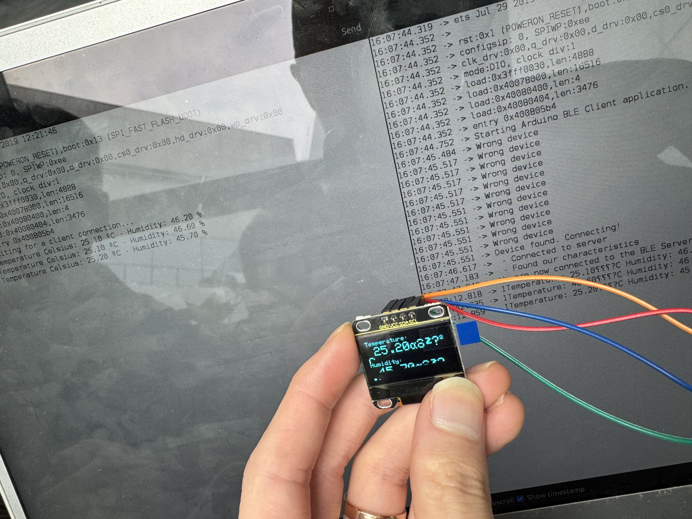
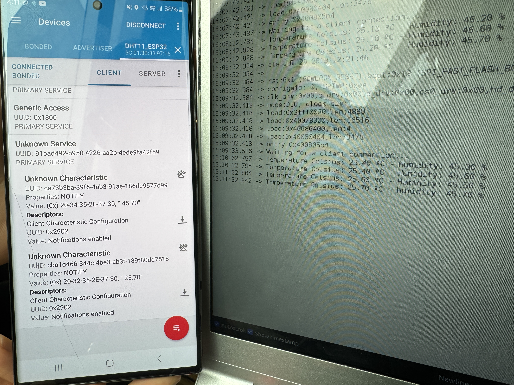

# IoT25-HW05
IoT ESP32 assignment 5
---

arduino ide upload screen
---

serial monitor output
---

client and serve is connected
---

server and phone application connected
---

server sending data to client
