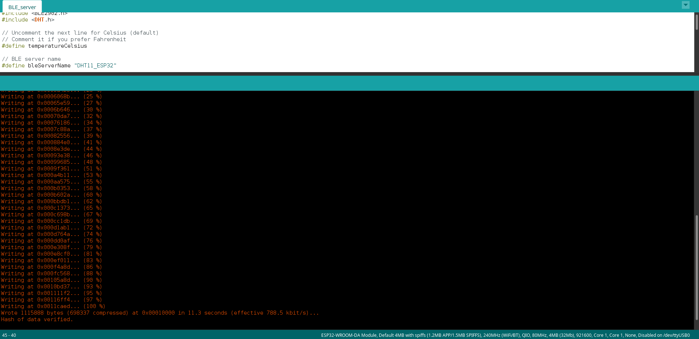
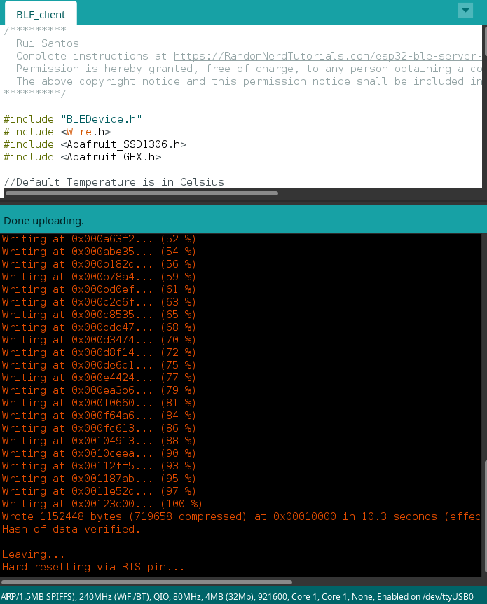
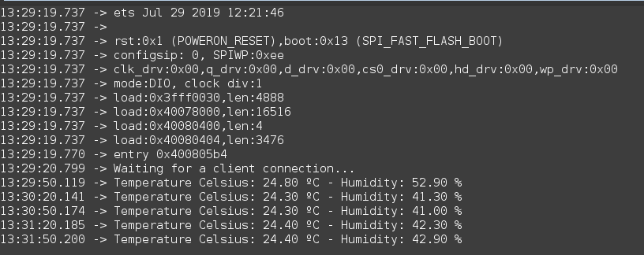

# IoT25-HW05
IoT ESP32 assignment 5
---

 
arduino ide server upload screen

---

 
arduino ide client upload screen

---

 
serial monitor output

---

 
client and serve is connected

---

 
server and phone application connected

---
 
server sending data to client
